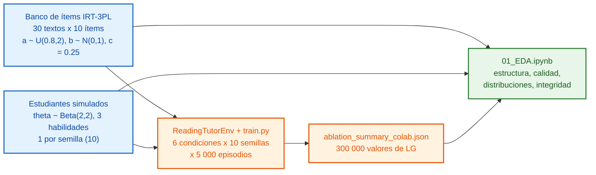

# 📊 EDA: Análisis Exploratorio de Datos

**Sistema de Tutoría Inteligente Adaptativa (DRL), Grupo 2, Maestría en IA, UNI**

| Entregable | Ruta |
|---|---|
| Notebook EDA (ejecutable en Colab) | [`notebooks/01_EDA.ipynb`](notebooks/01_EDA.ipynb) |
| Logs de entrenamiento (Colab, RTX A4000) | [`data/results/ablation_summary_colab.json`](data/results/ablation_summary_colab.json) |
| Muestra de datos: resumen por semilla | [`data/sample/resumen_por_semilla.csv`](data/sample/resumen_por_semilla.csv) |
| Muestra de datos: logs por episodio | [`data/sample/logs_muestra_ppo.csv`](data/sample/logs_muestra_ppo.csv) |
| Figuras (se generan al ejecutar) | `figures/eda/01–08_*.png` |

---

## 1. Fuentes de datos

| # | Fuente | Naturaleza | Volumen |
|---|---|---|---|
| 1 | Banco de ítems IRT-3PL | Sintética (`ReadingTutorEnv`) | 300 ítems por semilla |
| 2 | Estudiantes simulados | Sintética (`IRTStudent`) | 10 estudiantes |
| 3 | Registros de entrenamiento | Experimental (Colab) | 6 × 10 × 5 000 = 300 000 episodios |

Las fuentes 1 y 2 se regeneran en el notebook con el mismo generador y el mismo orden de llamadas que `src/environment.py`, así que son idénticas a las usadas en el entrenamiento.

## 2. Muestra de datos

**Resumen por semilla** (`data/sample/resumen_por_semilla.csv`, primeras filas):

| condicion | seed | lg_ultimo_ep | acc_ultimo_ep | lg_media_ep1_500 | lg_media_ep4501_5000 |
|---|---|---|---|---|---|
| B0 | 0 | 0.01026 | 0.72 | 0.03223 | 0.02499 |
| B0 | 1 | -0.01208 | 0.72 | -0.05857 | -0.05732 |
| B0 | 2 | -0.06664 | 0.80 | -0.08151 | -0.08435 |

El notebook también exporta `item_bank_seed0.csv` (banco de ítems) y `estudiantes_simulados.csv`.

## 3. Hallazgos principales (verificados sobre los logs)

| Condición | LG último episodio (media ± DE, 10 semillas) | LG medio ep. 4501–5000 | Acc. último ep. |
|---|---|---|---|
| B0 – B4 | −0.038 ± 0.128 | −0.030 | 0.73 |
| B5 | 0.511 ± 0.037 | 0.500 | 0.084 |

> [!WARNING]
> **Integridad de la matriz de ablación.**
> * **B0–B4 son idénticos bit a bit.** `train.py` usa `PPOAgent` en toda condición distinta de B5, así que las líneas base no existen en el código.
> * **B5 no viene entero de entrenamiento.** El propio `test_master_DRL.ipynb` registra *"B5 (Seed 1–9) sin datos. Generando curva teórica"* y *"B5 (Seed 0) interrumpido. Proyectando curva restante"*. Las semillas 1–9 tienen acc = 0.
> * Solo los registros PPO (10 semillas) son experimentales. La matriz se debe re-ejecutar antes de contrastar HG/HE3.

Otros hallazgos del EDA: escalas θ ∈ [0,1] y b ~ N(0,1) desalineadas, población efectiva de 10 estudiantes (`reset(seed=seed)` repite el mismo alumno) y un análisis de la factibilidad del umbral LG ≥ 0.50 bajo la dinámica del simulador (sección 2.1 del notebook).

## 4. Cómo reproducir

1. Abre el notebook con el botón **Open in Colab**.
2. `Entorno de ejecución → Ejecutar todas`. Solo usa numpy, pandas, matplotlib, seaborn y scipy, y no necesita GPU.
3. Las figuras se guardan en `figures/eda/` y las muestras en `data/sample/`.
