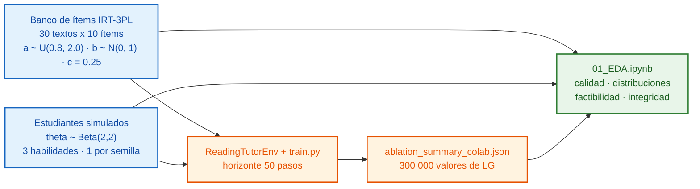
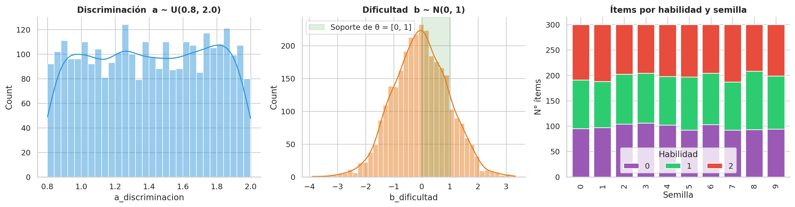
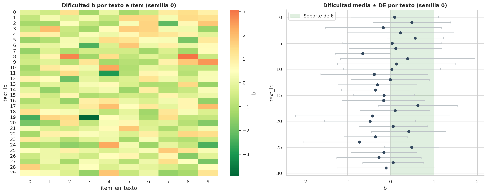
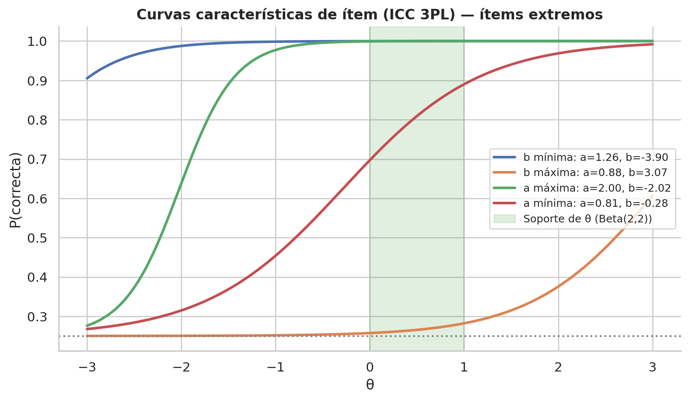
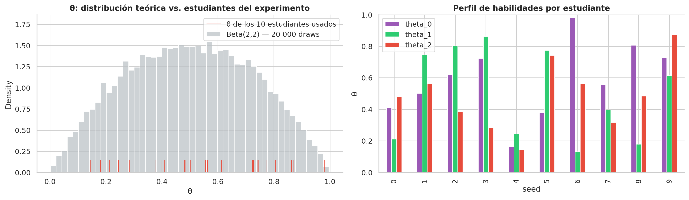
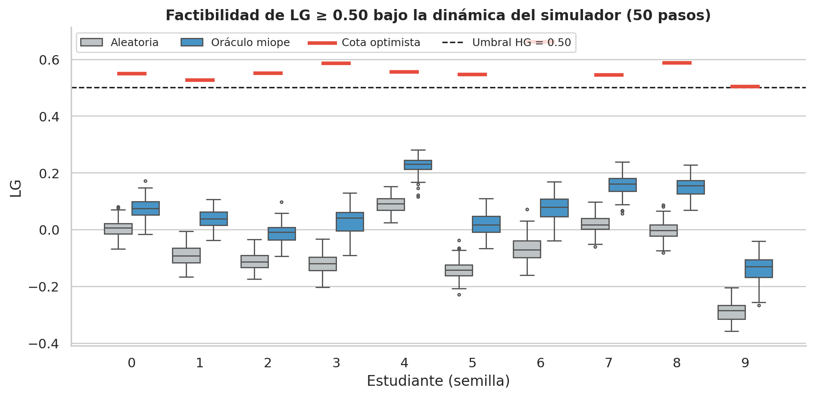
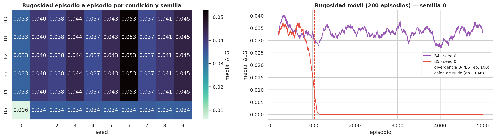
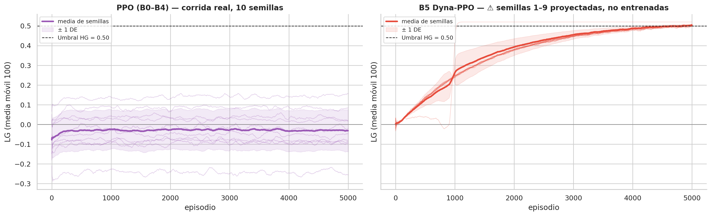
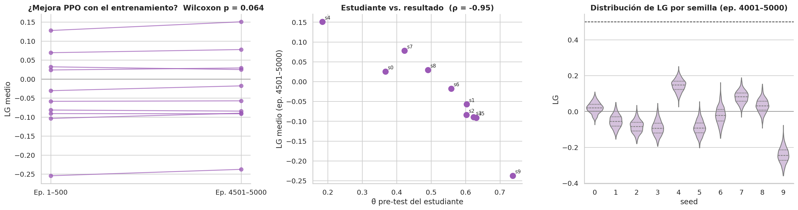

# 📊 EDA: Análisis Exploratorio de Datos

**Sistema de Tutoría Inteligente Adaptativa (DRL) · Grupo 2 · Maestría en IA · UNI**
*Proyecto de Investigación 2 · Prof. Glen Rodríguez*

> Todas las cifras de este documento provienen de la ejecución de [`notebooks/01_EDA.ipynb`](notebooks/01_EDA.ipynb), que se puede re-ejecutar de punta a punta.

---

## 🗂️ Contenido de la rama `eda`

| Artefacto | Archivo | Descripción |
|---|---|---|
| 📓 Notebook ejecutado | [`notebooks/01_EDA.ipynb`](notebooks/01_EDA.ipynb) | 29 celdas con tablas, figuras y pruebas estadísticas |
| 🧾 Logs de entrenamiento | [`data/results/ablation_summary_colab.json`](data/results/ablation_summary_colab.json) | 6.4 MB · 6 condiciones × 10 semillas × 5 000 episodios |
| 🧪 Muestra: banco de ítems | [`item_bank_seed0.csv`](notebooks/data/sample/item_bank_seed0.csv) | 300 ítems IRT de la semilla 0 |
| 👩‍🎓 Muestra: estudiantes | [`estudiantes_simulados.csv`](notebooks/data/sample/estudiantes_simulados.csv) | θ inicial de los 10 estudiantes y cota de LG |
| 📈 Muestra: logs por episodio | [`logs_sample_B4_seed0.csv`](notebooks/data/sample/logs_sample_B4_seed0.csv) · [`logs_muestra_ppo.csv`](data/samples/logs_muestra_ppo.csv) | Ganancia de aprendizaje (LG) episodio a episodio |
| 📋 Resumen por semilla | [`resumen_ppo_por_semilla.csv`](notebooks/data/sample/resumen_ppo_por_semilla.csv) · [`resumen_por_semilla.csv`](data/samples/resumen_por_semilla.csv) | Métricas iniciales vs. finales por semilla y condición |
| 🖼️ Figuras | [`notebooks/data/figures/eda/`](notebooks/data/figures/eda) | 8 figuras (embebidas abajo) |

---

## 1. Fuentes de datos

| # | Fuente | Naturaleza | Volumen |
|---|---|---|---|
| 1 | Banco de ítems IRT-3PL | Sintética, regenerada con el mismo generador que `environment.py` | 300 ítems/semilla · 3 000 filas |
| 2 | Estudiantes simulados | Sintética (`IRTStudent`) | 10 estudiantes (uno por semilla) |
| 3 | Registros de entrenamiento | Experimental (Colab, RTX A4000) | 300 000 episodios |

**Muestra de la data** (`item_bank_seed0.csv`, primeras 5 filas):

| item_id | text_id | a_discriminacion | b_dificultad | c_azar | habilidad |
|---:|---:|---:|---:|---:|---:|
| 0 | 0 | 1.5644 | −0.1321 | 0.25 | 0 |
| 1 | 0 | 0.8198 | −0.5357 | 0.25 | 0 |
| 2 | 0 | 1.8953 | 1.3040 | 0.25 | 2 |
| 3 | 0 | 1.4523 | −1.2654 | 0.25 | 2 |
| 4 | 0 | 1.7790 | 0.0413 | 0.25 | 1 |

---

## 2. Banco de ítems

### 2.1 Calidad y estadística descriptiva (3 000 ítems)

| Control | Resultado |
|---|---|
| Valores nulos | **0** |
| Duplicados (semilla, texto, ítem) | **0** |
| `a` fuera de [0.8, 2.0] | **0** |
| Ítems con b < 0 | **51.8 %** |
| Ítems con b > 1 | **14.6 %** |

| Variable | Media | DE | Mín | P25 | Mediana | P75 | Máx |
|---|---:|---:|---:|---:|---:|---:|---:|
| a (discriminación) | 1.4040 | 0.3463 | 0.8011 | 1.0995 | 1.4031 | 1.7113 | 1.9989 |
| b (dificultad) | −0.0308 | 0.9822 | −3.8994 | −0.6921 | −0.0434 | 0.6405 | 3.3230 |
| c (azar) | 0.2500 | 0.0000 | 0.2500 | 0.2500 | 0.2500 | 0.2500 | 0.2500 |

### 2.2 Hallazgo: escalas θ y b desalineadas

La habilidad vive en θ ∈ [0, 1], pero la dificultad sigue b ~ N(0, 1). Solo el **33.6 %** de los ítems cae dentro de [0, 1]. En `IRTStudent.learn` el alumno **solo aprende si acierta y |θ − b| < 0.5**. Para un estudiante típico (θ = 0.5):

| Nivel elegido por el agente | Desplazamiento de b | P(correcta) media | % en zona de aprendizaje | % triviales (P > 0.90) | % casi inalcanzables (P < 0.35) |
|:---:|:---:|:---:|:---:|:---:|:---:|
| 0 (fácil) | −0.5 | 0.846 | **23.4 %** | 58.4 % | 3.4 % |
| 1 (medio) | 0.0 | 0.749 | **33.6 %** | 37.8 % | 9.0 % |
| 2 (difícil) | +0.5 | 0.632 | **38.6 %** | 20.9 % | 19.7 % |

➡️ En el mejor nivel, **6 de cada 10 ítems no producen aprendizaje**: la recompensa es escasa (*reward sparsity*).

---

## 3. Estudiantes simulados

| Semilla | θ₀ | θ₁ | θ₂ | θ̄ pre-test | Cota optimista de LG |
|---:|---:|---:|---:|---:|---:|
| 0 | 0.410 | 0.211 | 0.481 | 0.368 | 0.549 |
| 1 | 0.503 | 0.746 | 0.562 | 0.604 | 0.527 |
| 2 | 0.618 | 0.804 | 0.386 | 0.603 | 0.550 |
| 3 | 0.724 | 0.863 | 0.283 | 0.623 | 0.586 |
| 4 | 0.165 | 0.245 | 0.144 | 0.184 | 0.555 |
| 5 | 0.378 | 0.774 | 0.742 | 0.632 | 0.546 |
| 6 | 0.981 | 0.132 | 0.563 | 0.559 | 0.662 |
| 7 | 0.555 | 0.396 | 0.318 | 0.423 | 0.544 |
| 8 | 0.807 | 0.180 | 0.485 | 0.491 | 0.588 |
| 9 | 0.727 | 0.613 | 0.871 | 0.737 | 0.504 |

> **Hallazgo:** `train.py` llama `env.reset(seed=seed)` en cada episodio, así que cada corrida entrena siempre con el **mismo** estudiante. La población efectiva es de **10 estudiantes**.

### 3.1 ¿Es alcanzable el umbral de la hipótesis general (LG ≥ 0.50)?

Se simularon 1 000 episodios por política con la dinámica exacta de `IRTStudent` y el escudo CMDP:

| Referencia | LG media | DE | Máximo | P(LG ≥ 0.50) |
|---|---:|---:|---:|---:|
| Política aleatoria | −0.0706 | 0.1058 | 0.1519 | **0 %** |
| Oráculo miope (conoce θ real) | 0.0620 | 0.1038 | 0.2813 | **0 %** |
| Cota optimista (techo teórico) | 0.5611 | 0.0430 | 0.6617 | 100 % |

➡️ El umbral 0.50 está **por debajo del techo teórico (0.56)**, así que no es imposible. Pero en 1 000 episodios ni siquiera un oráculo que conoce el θ real superó **0.28**. Con la dinámica actual del simulador, LG ≥ 0.50 exige secuencias casi perfectas.

---

## 4. Logs de entrenamiento

**Estructura:** 300 000 filas · **0 nulos** · **0 infinitos** · 6 condiciones × 10 semillas × 5 000 episodios.

| Condición | LG por episodio (media ± DE) | Mediana | LG último episodio (media) | Aciertos último episodio | Huella MD5 |
|:---:|:---:|:---:|:---:|:---:|:---:|
| B0 – B4 | −0.0291 ± 0.1094 | −0.0292 | −0.0384 | 0.73 | `e161828b5f37` (las 5 iguales) |
| B5 | 0.3754 ± 0.1446 | 0.4267 | 0.5105 | 0.084 (9 semillas con 0) | `5c3f02962e96` |

### 4.1 Auditoría de integridad

> [!WARNING]
> * **B0–B4 tienen la misma huella MD5:** son la misma corrida. `train.py` instancia `PPOAgent` en toda condición distinta de B5, así que las líneas base no están implementadas.
> * **B5-seed0 coincide con B4-seed0 en los primeros 100 episodios.** Es consistente con el calentamiento del *world model* (5 000 pasos = 100 episodios de 50 pasos).
> * **El ruido de B5-seed0 cae de golpe desde el episodio ≈ 1 046**, y **9 de 10 semillas de B5 tienen 0 aciertos registrados**. Esto concuerda con el log de `test_master_DRL.ipynb`: *"B5 (Seed 0) interrumpido. Proyectando curva restante"* y *"Seed 1–9 sin datos. Generando curva teórica"*.
> * Conclusión: los registros experimentales válidos son **PPO (10 semillas)** y los primeros ≈ 1 000 episodios de B5-seed0.

### 4.2 Dinámica de aprendizaje (datos válidos)

| Semilla | θ̄ pre-test | LG ep. 1–500 | LG ep. 4501–5000 | Δ |
|---:|---:|---:|---:|---:|
| 0 | 0.368 | 0.0322 | 0.0250 | −0.0072 |
| 1 | 0.604 | −0.0586 | −0.0573 | 0.0012 |
| 2 | 0.603 | −0.0815 | −0.0843 | −0.0028 |
| 3 | 0.623 | −0.1035 | −0.0898 | 0.0137 |
| 4 | 0.184 | 0.1278 | 0.1507 | 0.0229 |
| 5 | 0.632 | −0.0909 | −0.0913 | −0.0004 |
| 6 | 0.559 | −0.0306 | −0.0179 | 0.0126 |
| 7 | 0.423 | 0.0694 | 0.0777 | 0.0083 |
| 8 | 0.491 | 0.0239 | 0.0292 | 0.0053 |
| 9 | 0.737 | −0.2544 | −0.2376 | 0.0168 |

| Prueba | Resultado | Lectura |
|---|---|---|
| Wilcoxon (últimos 500 vs. primeros 500 episodios) | W = 9.0, **p = 0.0645** | PPO no mejora de forma significativa (α = 0.05) |
| Spearman θ̄ pre-test vs. LG final | **ρ = −0.95**, p < 0.001 | El resultado lo determina el estudiante, no la política |

➡️ El olvido es multiplicativo (θ · (1 − u)) y la ganancia es proporcional a (1 − θ). Por eso los estudiantes con θ alto pierden más de lo que ganan: el resultado de LG depende del estudiante, no de la política.

---

## 5. Hallazgos y decisiones accionables (insumo para Semana 5)

| # | Hallazgo (evidencia) | Decisión de Feature Engineering / experimento |
|---|---|---|
| H1 | Escalas desalineadas: solo 33.6 % de b ∈ [0, 1] (§2.2) | Reescalar la dificultad a [0, 1] (sigmoide o min-max) **ajustada solo con train** |
| H2 | 58.4 % de ítems triviales en nivel 0 (§2.2) | Feature de dominio **brecha cognitiva** `gap = θ − b_adj` en la observación |
| H3 | Mismo estudiante en todos los episodios (§3) | Muestrear un estudiante nuevo por episodio y separar estudiantes train / test (validación por grupos) |
| H4 | Oráculo máx. 0.28 vs. umbral HG 0.50 (§3.1) | Recalibrar horizonte y tasas del simulador, o revisar el umbral de HG |
| H5 | LG explicado por θ inicial, ρ = −0.95 (§4.2) | Reportar LG normalizado por estudiante y estratificar por θ inicial |
| H6 | B0–B4 idénticos; B5 incompleto (§4.1) | Implementar B0–B3 y re-ejecutar la matriz: **un cambio por experimento**, 10 semillas fijas |
| H7 | Señales de racha y fatiga implícitas en la LSTM | Features explícitas: `error_streak`, `rolling_acc_5` (apoyan al escudo CMDP) |

**Plan de ablación (Semana 5, un cambio por vez):**

| Variante | Cambio respecto a la anterior | Métrica principal | Secundarias |
|---|---|---|---|
| Baseline | PPO actual (datos válidos de esta EDA) | LG media ± DE (10 semillas) | Aciertos, episodios hasta convergencia |
| V1 | + dificultad reescalada a [0, 1] | ídem | ídem + tiempo/episodio |
| V2 | + feature `gap` y racha | ídem | ídem |
| V3 | + Dyna-PPO (world model) | ídem | ídem + costo de cómputo |

---

## 6. Reproducibilidad

1. Abrir con **Open in Colab** (botón superior), Jupyter local o JupyterLite.
2. Ejecutar todas las celdas. Solo usa numpy, pandas, matplotlib, seaborn y scipy, sin GPU.
3. El notebook regenera las figuras y las muestras de datos.
