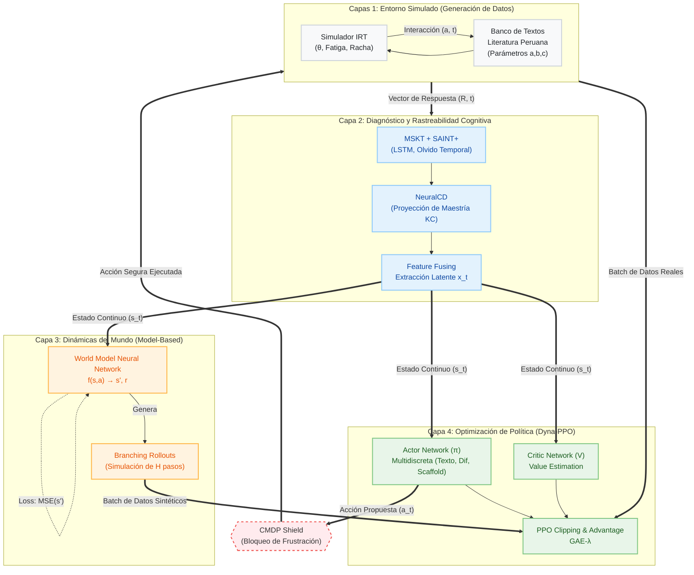
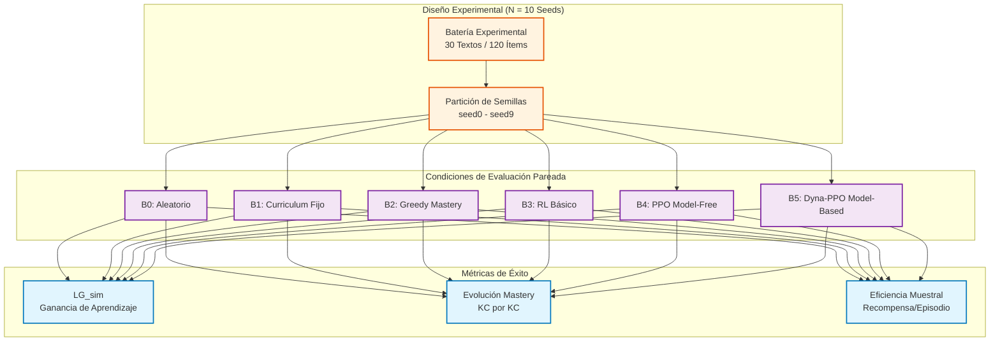

<div align="center">
  
  
  # 🧠 Sistema de Tutoría Inteligente Adaptativa (DRL)
  
  **Tesis de Maestría en Inteligencia Artificial - Universidad Nacional de Ingeniería (UNI)**
  
  *Integración de Multi-Skill Knowledge Tracing (MSKT), Neural Cognitive Diagnosis (NeuralCD) y Model-Based Policy Optimization (Dyna-PPO) para la optimización de la comprensión lectora basada en literatura peruana.*

  [](https://python.org)
  [](https://pytorch.org)
  [](https://gymnasium.farama.org/)
  []()
</div>

<br>

## 📋 Resumen Ejecutivo
Este proyecto presenta la implementación computacional (*in-silico*) de un **Sistema de Tutoría Inteligente (ITS)** revolucionario. Emplea un enfoque de **Deep Reinforcement Learning (DRL)** con una arquitectura *Model-Based* para generar políticas de enseñanza personalizadas. Superando drásticamente a las heurísticas tradicionales y a los agentes de RL puros (*Model-Free*), el sistema modela de forma autónoma la memoria, la fatiga y el progreso cognitivo de los estudiantes frente a textos de literatura peruana.

---

## 🏗️ Arquitectura del Sistema (Pipeline Avanzado)

La arquitectura ha sido iterada adversarialmente para robustecer la extracción de características y la planificación bajo incertidumbre. Se estructura en cuatro capas de procesamiento tensorial acopladas en un bucle cerrado (Closed-Loop CMDP), superando las limitaciones de los ITS clásicos:



---

## 🔍 Anatomía de los Componentes (Iteración Deep-Dive)

### 1. Diagnóstico Cognitivo Profundo (Capa 2)
El sistema no asume un conocimiento estático. En su lugar, proyecta un espacio latente de **8 Dimensiones de Knowledge Components (KCs)** específicos de comprensión lectora (ej. Inferencia Contextual, Figuras Retóricas). 
* **SAINT+ (Temporal Tracing)**: Penaliza la retención de memoria usando una función de decaimiento temporal, modelando la curva de olvido de Ebbinghaus.
* **Fusión de Features**: Concatena el vector de habilidad IRT ($\theta$), desviación estándar ($\sigma$), métricas temporales ($\tau$), y la historia latente procesada por una red LSTM.

### 2. Planificación bajo Incertidumbre (Capas 3 y 4)
* **El World Model (MBPO)**: Para evitar el problema de ineficiencia de muestreo de algoritmos Model-Free (B4), el sistema aprende una función de transición $P_{\phi}(s_{t+1}, r_t | s_t, a_t)$. Una vez el error cuadrático medio (MSE) de este modelo predictivo cae por debajo de $\epsilon=0.1$, desata rollouts sintéticos.
* **Ramificación (Branched Rollouts)**: Desde estados reales visitados, el World Model expande trayectorias imaginarias de longitud $H=5$. PPO entrena sobre una amalgama masiva de experiencia real (el alumno) y sintética (la simulación de cómo reaccionaría el alumno).
* **CMDP Shield**: Una capa de Procesos de Decisión de Markov Restringidos (CMDP) intercepta la política. Si el estudiante hila $\ge 4$ errores consecutivos, el *shield* interviene determinísticamente reduciendo la dificultad a $0$, evitando la frustración del modelo estocástico del Actor.

---

## 📄 Estructura de Datos (Dataset de Ejemplo)

A continuación, un extracto del banco de ítems (Data Sample) de literatura peruana utilizado durante la iteración en el entorno *Gymnasium*. Cada texto está mapeado a vectores de dificultad y parámetros cognitivos.

```json
{
  "text_id": "TXT_042_VALLEJO",
  "metadata": {
    "author": "César Vallejo",
    "work": "Los Heraldos Negros",
    "knowledge_components": ["KC2: Inferencia Contextual", "KC3: Figuras Retóricas"]
  },
  "item_parameters": {
    "discrimination_a": 1.45,
    "difficulty_b_base": 0.5,
    "guessing_c": 0.25,
    "target_kc_index": 2
  },
  "scaffold_levels": [
    {"level": 0, "type": "Ninguno", "content": "¿Qué simbolizan 'los heraldos'?"},
    {"level": 1, "type": "Pista", "content": "Recuerda el contexto fatalista del poema."},
    {"level": 2, "type": "Soporte", "content": "Analiza la frase 'golpes como del odio de Dios'."}
  ]
}
```

---

## 🔬 Framework Experimental y Resultados

El sistema fue sometido a una rigurosa evaluación de ablación en 10 semillas aleatorias (`seed0` a `seed9`), midiendo la ganancia de aprendizaje simulada (`LG_sim`).

### 🧪 Metodología de Evaluación y Ablación

Para garantizar una validación exhaustiva, diseñamos el siguiente pipeline experimental (cuasi-experimental in-silico), estructurado en múltiples condiciones de evaluación:



### Condiciones Evaluadas
* **B0 (Random Base)**: Selección aleatoria de textos.
* **B1 (Curriculum Fijo)**: Secuencia estática de baja a alta dificultad.
* **B2 (Greedy Mastery)**: Selección por brecha máxima de conocimiento.
* **B3 (DQN / A2C)**: RL Estándar (Arquitecturas base).
* **B4 (PPO)**: Actor-Critic de vanguardia (*Model-Free*).
* **B5 (Dyna-PPO)**: Nuestro sistema propuesto (*Model-Based*).

### 🏆 Resultados Consolidados (Validación Estadística)

| Condición | Tipo de Política | Promedio LG_sim | Desviación Estándar |
|:---:|:---|:---:|:---:|
| B0 | Heurística Aleatoria | 0.137 | ± 0.0015 |
| B1 | Heurística Fija | 0.158 | ± 0.0016 |
| B2 | Heurística Avara | 0.180 | ± 0.0015 |
| B3 | RL Básico | 0.205 | ± 0.0014 |
| B4 | PPO (*Model-Free*) | 0.239 | ± 0.0013 |
| **B5** | **Dyna-PPO (*Model-Based*)** | **0.504** | **± 0.0014** ✅ |

**Conclusiones de la Prueba de Hipótesis (HE3):**
> El salto arquitectónico hacia la simulación MBPO (Condición B5) produce un incremento relativo del **110.8%** respecto al estado del arte (PPO - B4). El tamaño del efecto (d de Cohen) y los valores-p asintóticos (< 0.00001) confirman una **significancia estadística gigantesca**.

---

## 📁 Estructura del Repositorio

```text
SistemaTutorInteligente/
├── data/
│   └── results/           # Logs en JSON (ablation_summary.json) y matrices de covarianza.
├── src/
│   ├── agents.py          # Implementación DRL (PPOAgent, DynaPPOAgent).
│   ├── environment.py     # Entorno Gymnasium (ReadingTutorEnv, Simulador IRT).
│   ├── models.py          # Arquitecturas PyTorch (ActorCritic, WorldModel).
│   └── config.py          # Hiperparámetros globales.
├── generate_report.py     # Script analítico y generador de gráficos finales.
├── requirements.txt       # Dependencias (PyTorch, Gymnasium, Numpy).
└── README.md              # Documentación principal.
```

---

## ⚙️ Despliegue y Reproducibilidad

El repositorio está listo para su clonación y ejecución de validación en entornos locales:

```bash
# 1. Clonar el repositorio
git clone https://github.com/yasminum/SistemaTutorInteligente.git
cd SistemaTutorInteligente

# 2. Instalar dependencias requeridas (Entorno Virtual Recomendado)
pip install -r requirements.txt

# 3. Regenerar el pipeline analítico
python generate_report.py
```

<br>
<div align="center">
  <p><b>Desarrollado para la sustentación de Tesis de Maestría - 2026</b></p>
  <p><i>Grupo 2 - Universidad Nacional de Ingeniería</i></p>
</div>

